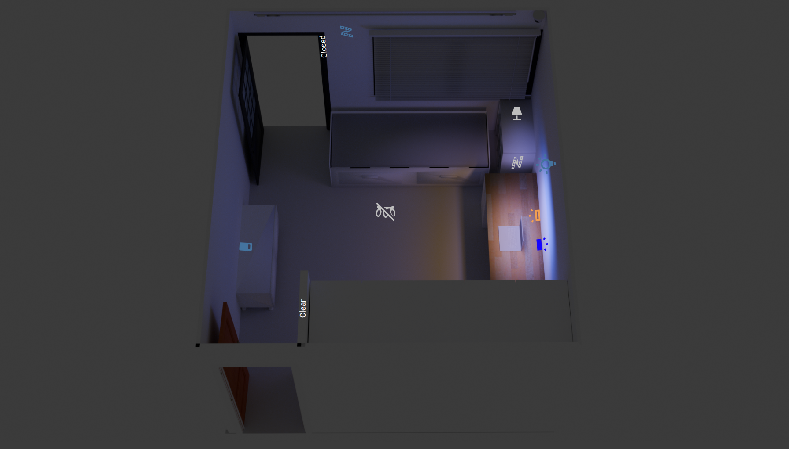

# roomviz

3D interactive room dashboard powered by Home Assistant.
This project turns a Sweet Home 3D model into Blender renders mapped to device/entity states, including single-light states and composite lighting scenes for a realistic room visualization.

## Pipeline

Sweet Home 3D -> OBJ -> Blender -> Render -> Home Assistant

1. **Sweet Home model**

2. **Blender model**

3. **Render output**

4. **Home Assistant dashboard**

## How it works

- Model the room in Sweet Home 3D and export to OBJ.
- Import OBJ into Blender and prepare materials, lights, and camera.
- Render one image per device state plus extra composite scene renders.
- Store output images in `assets/renders/` with stable filenames.
- Map filenames to Home Assistant entity states in `home-assistant/` YAML.

## Home Assistant integration

- Install/open **File editor** (via HACS if needed).
- Create an additional dashboard/view in Home Assistant using **Panel** mode.
- In Home Assistant, go to `www/` and create a folder (for example: `www/room3d/`).
- Upload all render files there (including `transparent.png`).
- In Lovelace YAML, reference files as `/local/<folder>/<file>.png` (example: `/local/room3d/default.png`).
- Use `type: image` elements, and define `on/off/unavailable` states in `state_image` (`off` and `unavailable` use `transparent.png`).
- Use `state-icon` entries to toggle entities and `conditional` overlays for composite renders.

## Structure

- `models/` → source models (SweetHome, OBJ, Blender)
- `assets/renders/` → rendered images used in the dashboard
- `home-assistant/` → YAML configuration

## Generated renders

| Render | Preview |
|---|---|
| `default.png` |  |
| `govee-lights-bar.png` |  |
| `govee-strings-lights.png` |  |
| `smart-color-bulb.png` |  |
| `wled-strip-down.png` |  |
| `wled-strip-up.png` |  |
| `yeelight-ambilight.png` |  |
| `yeelight-bedside-lamp.png` |  |
| `yeelight-main-light.png` |  |

## Composite renders (scenes)

| Render | Lights combination | Preview |
|---|---|---|
| `1-3.png` | `yeelight-ambilight` + `yeelight-main-light` |  |
| `1-4.png` | `wled-strip-up` + `wled-strip-down` |  |
| `1-5.png` | `wled-strip-up` + `wled-strip-down` + `yeelight-main-light` + `yeelight-ambilight` + `yeelight-bedside-lamp` + `govee-lights-bar` |  |
| `1-6.png` | Same as `1-5.png` but without `yeelight-main-light` |  |
| `1-7.png` | All lights on |  |

## Notes

- `.sh3d` is the base model
- `.blend` contains lighting and render setup
- renders in `assets/renders/` are mapped to entity states in Home Assistant
